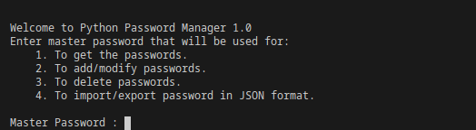
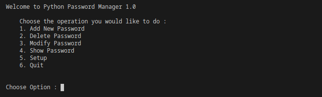

# Password Manager

## Prerequisites

* Python >= 3.5 (Because we are using Python typing that was introduced in Python 3.5)
* All modules mentioned in _Pipfile_

## Installing Pipenv

You can install pipenv using `pip install pipenv` . After this you can install all modules mentioned in `Pipfile` using command `pipenv install`.

## Using Password Manager CLI

Before you actual users can fetch passwords from __Pasword Manager__ you will need to setup and add some passwords to this utility. You can do this setup by running

```shell
python setup.py
```

When running this for first time you will asked to enter your master password.


__Master Password__ will be used for :

* Encrypting you other passwords that you will store in this utility.
* Authentication when you will be adding/deleting/modifying other passwords.
* Import/Export Passwords in JSON format.

Once master password is set you will get new screen as shown below


## Using Client Class

This python class can be used in your other python projects to get passwords stored by this utility. Follow the setps as below:

1. `pipenv install password-manager` or `pip install password-manager`
2. `from passwordmanager import PasswordManager`
3. `password_manager = PasswordManager()`
4. `password_manager.get_password(key)`

## TODOs

* Import/Export to JSON feature
* Remote password fetch. If passwords are stored in different machine in comparison to its users

## Release Notes

* 1.0.0
Initial Release
